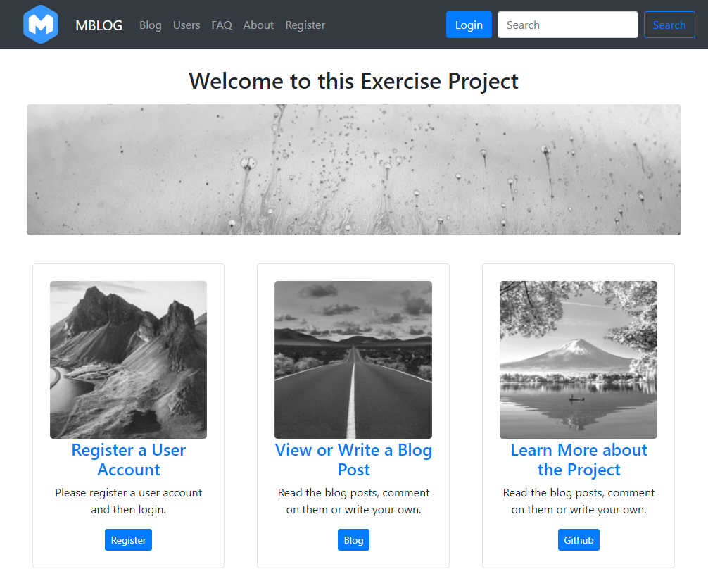

# Web Dev2: Heroku-Flask

This is a project for the SmartNinja Web Development 2 course using Python, Flask, Jinja and a Heroku Server, it is deployed here: https://wd2-2020-flask-mb.herokuapp.com/

<kbd></kbd>

## How to use Flask Migrate
- Make sure that FLASK_APP environment variable is set
  - Unix: `export FLASK_APP=main.py`
  - Windows: `set FLASK_APP=%cd%\main.py`
 
- Remove the database

- If using flask migrate the first time, initialize it: `flask db init`. this will create a folder called *migration* in the project with all migration commands
- After each change, migrate: `flask db migrate -m "<change description>"`
- Run upgrade from the migration, this is how to upgrade on the server based on alembic versions folder: `flask db upgrade`
- Additionally, test locally first, and adjust update steps in upgrade scripts if necessary

## Add Release Tasks
- Create release_tasks.sh
- Update Procfile to have a release phase: `release: ./release-tasks.sh`
- Update release tasks permissions:
  - `git update-index --chmod=+x release-tasks.sh`

